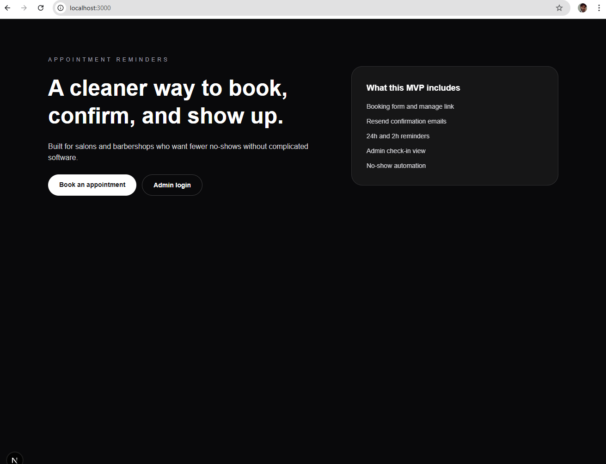
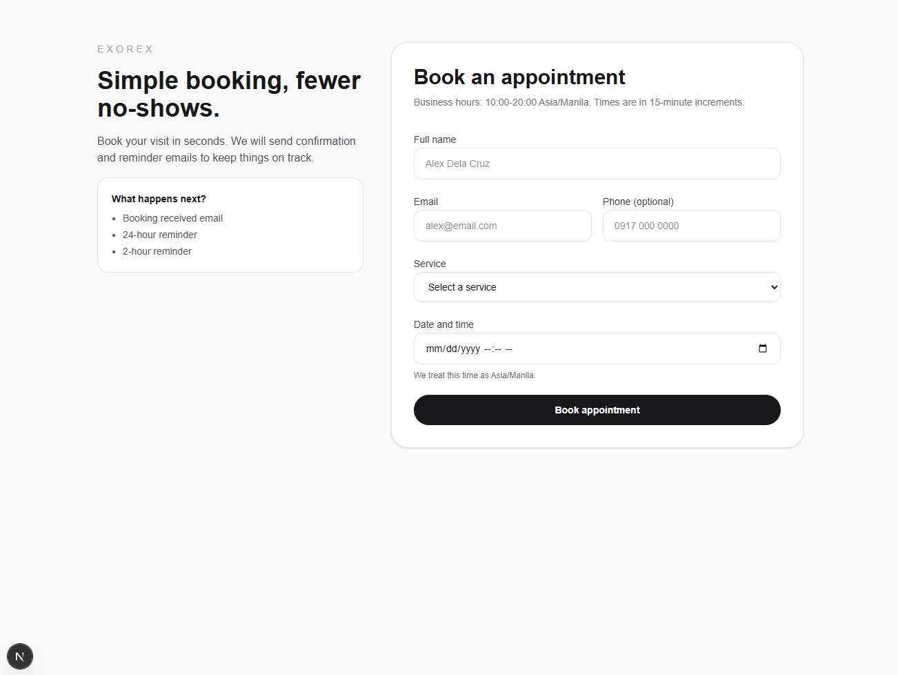
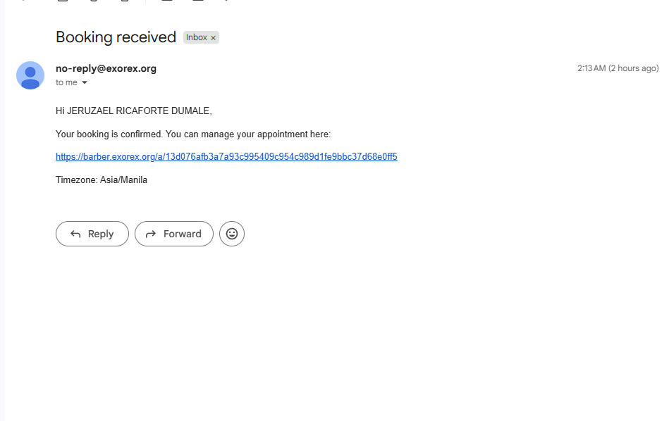
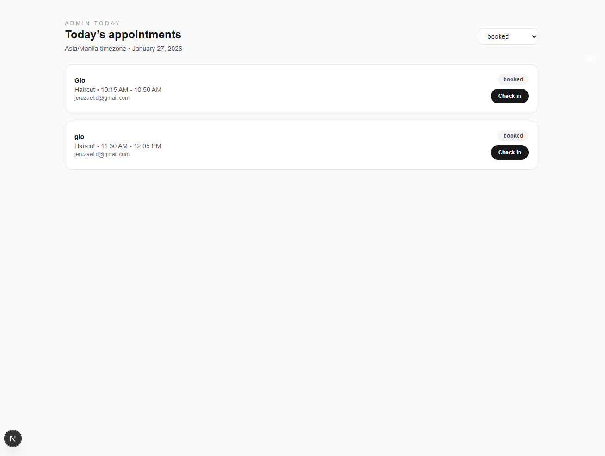
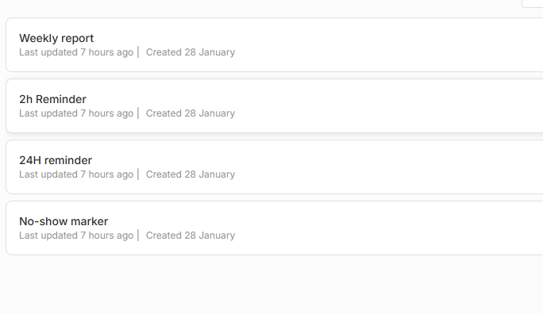
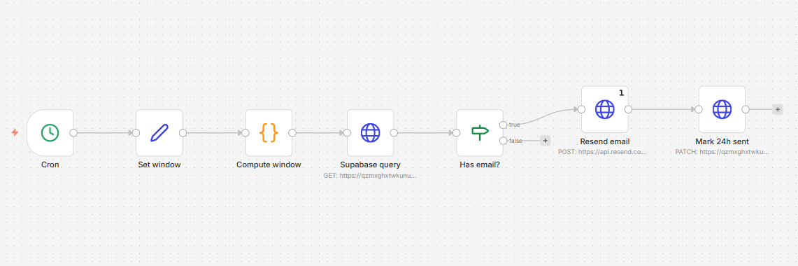
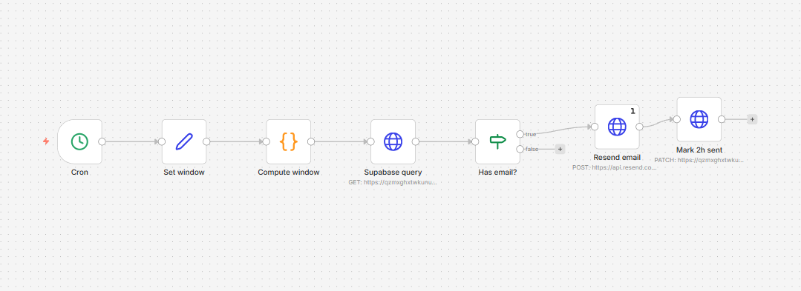
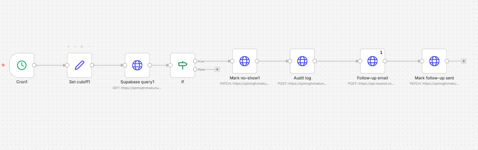
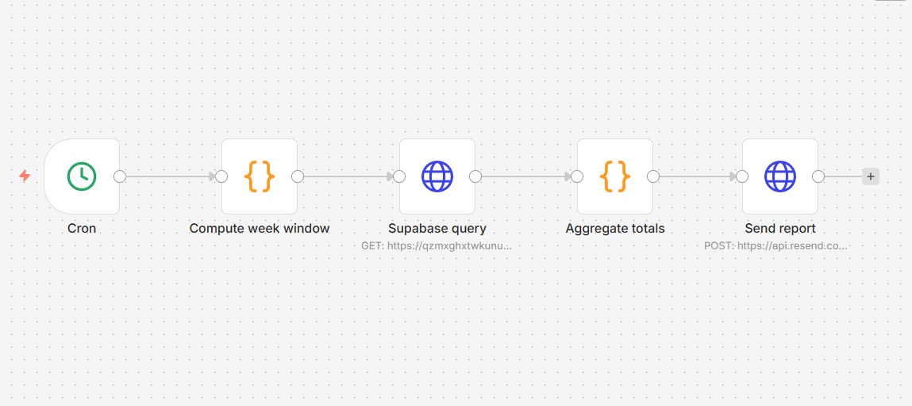

# README

## What this system does
A simple appointment reminder and no-show reduction system for salons and barbershops. Customers book appointments, receive confirmation and reminders, and manage their booking via a secure link. Staff use an admin view to check in clients and track no-shows.

## Tech stack
- Next.js (App Router)
- Supabase (Postgres + Auth)
- n8n (scheduled reminder automation)
- Resend (all outbound email)
- Playwright (E2E tests)

## Product UI (screenshots with context)
**Landing page** — entry point for customers and admins.



**Booking page** — customer booking form with time selection.



**Confirmation email** — booking received message with manage link.



**Admin today view** — check-in and status tracking.



## Quick start (beginner-friendly)
1) Install Node.js 20.x and Git.
2) Clone the repo:
   - `git clone <REPO_URL>`
   - `cd simp_appointment_reminder_no-show-reduc`
3) Install dependencies:
   - `npm install`
4) Create `.env.local` using `.env.local.example`:
   - `NEXT_PUBLIC_SUPABASE_URL`
   - `NEXT_PUBLIC_SUPABASE_ANON_KEY`
   - `SUPABASE_SERVICE_ROLE_KEY`
   - `RESEND_API_KEY`
   - `EMAIL_FROM_ADDRESS`
   - `APP_BASE_URL=http://localhost:3000`
5) In Supabase, run `docs/03-Implementation/Supabase-Schema.sql`.
6) Seed services in Supabase:
   ```sql
   insert into services (name, duration_minutes, active)
   values ('Haircut', 30, true), ('Haircut + Shave', 45, true), ('Hair Color', 60, true);
   ```
7) Start the app:
   - `npm run dev`
8) Open:
   - `http://localhost:3000/book`

## Supabase setup (schema + RLS)
1) Open Supabase SQL editor for your project.
2) Paste and run `docs/03-Implementation/Supabase-Schema.sql`.
3) Verify tables and policies were created successfully.

## Resend sender note
Use a verified sender domain in Resend. Example: `no-reply@exorex.org`.

## n8n workflows (screenshots with context)
**Workflow overview** — all automations in one place.



**24h reminder** — sends the day-before reminder and updates the sent timestamp.



**2h reminder** — sends the 2-hour reminder and updates the sent timestamp.



**No-show workflow** — marks no-show, sends follow-up, writes audit log.



**Weekly report** — optional weekly summary email (kept inactive by default).



## E2E tests (Playwright)
1) Create `.env.test` from `.env.test.example`
2) Set:
   - `TEST_SERVICE_ID=<services.id>`
   - `TEST_CUSTOMER_EMAIL=you@example.com` (optional)
3) Install browsers:
   - `npx playwright install`
4) Run:
   - `npm run test:e2e`

## Key docs
- Start here: `docs/00-Overview/Start-Here.md`
- Scope: `docs/00-Overview/Scope.md`
- Architecture: `docs/02-Design/Architecture.md`
- API spec: `docs/02-Design/API-Spec.md`
- Automation flows: `docs/02-Design/Automation-Flows.md`
- Deployment: `docs/05-Deployment-and-Ops/Deployment-Guide.md`
- Release checklist: `docs/05-Deployment-and-Ops/Release-Checklist.md`
- Handover: `docs/08-Handovers/Client-Handover.md`

## Environments
- Dev: local Next.js + Supabase dev project + n8n dev instance
- Staging: Vercel preview or VPS staging + Supabase staging + n8n staging
- Prod: `barber.exorex.org` (web) + `n8n.exorex.org` (n8n) + Supabase prod

## Troubleshooting
- Missing Supabase env vars: verify `.env.local` matches `docs/03-Implementation/Environment-Setup.md`
- Booking fails: check Supabase RLS policies and table schema
- Reminders not sending: check n8n workflow runs and Resend credentials
 - Build errors on deploy: run `npm run predeploy` locally to catch TypeScript issues

## What we built (current status)
- Booking flow and confirmation email
- Manage link page
- Admin login (magic link) and today view with check-in
- n8n workflows for 24h, 2h, and no-show follow-up
- Production runbook + deployment checklist
